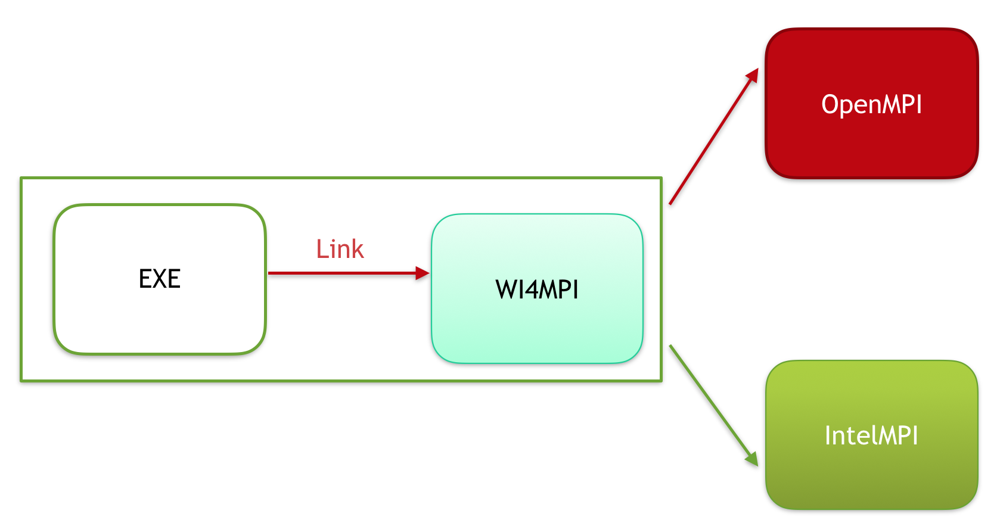

# WI4MPI                                                                        

This is **WI4MPI**, Wrapper Interface For MPI performing a light translation between MPI constants and MPI objects from an MPI implementation to another one.

WI4MPI provides two different mode:

Preload :


Interface :


## Installation

### Prerequisites

* C and Fortran compiler
* [OpenMPI](https://www.open-mpi.org/)

WI4MPI has been tested on GNU/Linux only

### Compilation

```
$ mkdir BUILD ; cd BUILD
$ cmake -DCMAKE_INSTALL_PREFIX=/path-install/wi4mpi-%version /path/to/wi4mpi/source/root
$ make -j 4 && make install                          
```                                                           

## Quick start

WI4MPI dedicated launcher available in /path-install/wi4mpi-%version/bin/wi4mpi allow an easy use of the
 library. To work, users only have to set the path to the different MPI implementation installation in /
path-install/wi4mpi-%version/etc/wi4mpi.cfg configuration file.

```
Usage: [MPIRUN] [MPIRUN_OPTION]... wi4mpi [option].. PROGRAM [PROGRAM_OPTION]...
  Option:
    -f FROM      the MPI implentation from which PROGRAM was compiled with
    -t TARGET    the MPI implentation to which PROGRAM will be run

The -f FROM option is optionnal. If not provided, the interface mode is choosen.
```

```
$ mpirun -np 4 wi4mpi -f openmpi -t intelmpi mpi_hello.exe
You are using Wi4MPI-%version with the mode preload From OMPI To INTEL
Hello_world 0
Hello_world 2
Hello_world 3
Hello_world 1

$ mpirun -np 4 wi4mpi -t intelmpi mpi_hello.exe
You are using Wi4MPI-%version with the mode interface From Interface To IntelMPI-2017.0.2.174
Hello_world 0
Hello_world 1
Hello_world 2
Hello_world 3
```

## Features

With the Interface mode a default conversion can be set during the compilation of the user application:

```
-wi4mpi_default_run_path    set a default MPI conversion
                            for the user application.
                            accepted values :
                              - OMPI
                              - IMPI
```
To set the conversion Interface to OpenMPI please preceed as follow:

```
$ WI4MPI_CC=icc/gcc WI4MPI_ROOT=/path/to/wi4mpi/root mpicc -wi4mpi_default_run_path OMPI test.c -o init

mpirun -np 4 ./init
```

With the interface mode, wi4mpi provide an embedded mode where the binary file can be moved from a cluster to another one without compilation process. The only rule is to have IntelMPI/MPICH/MVAPICH or OpenMPI/BullxMPI available the system

```
coming soon
```

## Configuration

All variable used by WI4MPI to configure the library according to the different modes and conversions:  
                                                                                                        
WI4MPI environment variables:                                                                                         
                                                                                                        
  **WI4MPI_ROOT**             : reference to root wi4mpi installation                                        
  **WI4MPI_CC**               : reference C compiler used by wi4mpi                                                                               
  **WI4MPI_FC**               : reference Fortran compiler used by wi4mpi                                   
  **WI4MPI_CXX**              : reference C++ compiler used by wi4mpi                                                                                  
  **WI4MPI_RUN_MPI_C_LIB**    : reference the path to the underlying run MPI implementation path C library  
  **WI4MPI_RUN_MPI_F_LIB**    : reference the path to the underlying run MPI implementation path Fortran library                                                                                                    
  **WI4MPI_WRAPPER_LIB**      : reference the path to the wrapper library call by the interface             
  **WI4MPI_APP_INCLUDES**     : reference the path to the internal include used by the jit trick to handle user function                                                                                            
  **WI4MPI_COMPILE_OPT**      : reference the option passed during jit compilation                          
  **WI4MPI_INTERNAL_INCLUDE** : reference the path to the internal include necessary to jit                 
  **WI4MPI_FROM**             : reference FROM which MPI implementation the application has been compiled   
  **WI4MPI_TO**               : reference the desired Runtime MPI implementation                            
  **LD_PRELOAD**              : see man                                                                     
  **LD_LIBRARY_PATH**         : see man                                                                     

Preload settings:                                                                                       
                                                                                                        
{FROM} and {TO} can take as value OMPI or INTEL depending on the choosen conversion                     

```
export WI4MPI_RUN_MPI_C_LIB="/path/to/MPI-runtime-implementation/libmpi.so"                             
export WI4MPI_RUN_MPI_F_LIB="/path/to/MPI-runtime-implementation/libmpi_mpifh.so"                       
export LD_PRELOAD="path_to_wi4mpi_install/libexec/libwi4mpi_{FROM}_{TO}.so $WI4MPI_RUN_MPI_F_LIB $WI4MPI
_RUN_MPI_C_LIB"                                                                                         
export WI4MPI_APP_INCLUDES="/path/to/wi4mpi/INTERNAL/preload/include/{FROM}_{TO}"                       
if OpenMPI --> OpenMPI                                                                                  
  export LD_LIBRARY_PATH="path_to_wi4mpi_install/libexec/fakelibCXX:$LD_LIBRARY_PATH"                   
  WI4MPI_COMPILE_OPT "-Dompi_ompi -DOMPI_OMPI"                                                          
else if OpenMPI --> IntelMPI                                                                            
  export LD_LIBRARY_PATH="path_to_wi4mpi_install/libexec/fakelibCXX:path_to_wi4mpi_install/libexec/fakel
ibOMPI:$LD_LIBRARY_PATH"                                                                                
  WI4MPI_COMPILE_OPT "-Dompi_mpich -DOMPI_INTEL"                                                        
else if IntelMPI --> IntelMPI                                                                           
  export LD_LIBRARY_PATH="path_to_wi4mpi_install/libexec/fakelibCXX:$LD_LIBRARY_PATH"                   
  WI4MPI_COMPILE_OPT "-Dmpich_mpich -DINTEL_INTEL"                                                      
else if IntelMPI --> OpenMPI                                                                            
  export LD_LIBRARY_PATH="path_to_wi4mpi_install/libexec/fakelibCXX:path_to_wi4mpi_install/libexec/fakel
ibINTEL:$LD_LIBRARY_PATH"                                                                               
  WI4MPI_COMPILE_OPT "-Dmpich_ompi -DINTEL_OMPI"                                                        
```

Interface settings:                                                                                     
                                                                                                        
{FROM} and {TO} can take as value OMPI or INTEL depending on the choosen conversion                     
                                                                                                        
```
export WI4MPI_INTERNAL_INCLUDES="path_to_install/INTERNAL/include"                                      
export WI4MPI_ROOT="/path_to_wi4mpi_install_root"                                                       
export WI4MPI_CC=icc                                                                                    
export WI4MPI_FC=ifort                                                                                  
export WI4MPI_CXX=icpc                                                                                  
export WI4MPI_RUN_MPI_C_LIB="/path/to/MPI-runtime-implementation/libmpi.so"                             
export WI4MPI_RUN_MPI_F_LIB="/path/to/MPI-runtime-implementation/libmpi_mpifh.so"                       
export WI4MPI_WRAPPER_LIB="path_to_wi4mpi_install/lib_IMPI/libwi4mpi_CCC_{TO}.so"                       
export WI4MPI_APP_INCLUDES="path_to_install/INTERNAL/interface/include/{FROM}_{TO}"                     
export LD_LIBRARY_PATH="path_to_install/lib:$LD_LIBRARY_PATH"                                           
if CCC --> IntelMPI                                                                                     
  export WI4MPI_COMPILE_OPT="-Dompi_ompi -DOMPI_OMPI"                                                   
else if CCC --> OpenMPI                                                                                 
  export WI4MPI_COMPILE_OPT="-Dompi_mpich -DOMPI_INTEL"                                                 
```


## Contributing
## Authors

* vincent.ducrot.tgcc@cea.fr
* tony.delforge.tgcc@cea.fr 
 
## Contact

* bruno.froge@cea.fr  
* marc.perache@cea.fr 

## Website

[CEA-HPC](http://www-hpc.cea.fr/)


## License

Copyright 2015-2017 CEA/DAM/DIF<br />
<br />
WI4MPI is distributed under the CeCILL-C. See the included files <br />
Licence_CeCILL-C_V1-en.txt (English version) and <br />
Licence_CeCILL-C_V1-fr.txt (French version) or visit  <br />
http://www.cecill.info for details.
