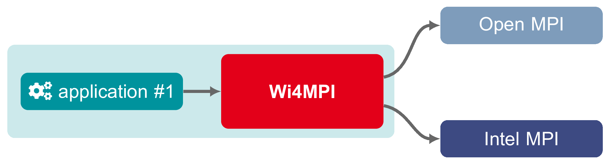

# WI4MPI


**WI4MPI** is an MPI wrapper and interoperability library that enables seamless runtime conversions between
various MPI implementations. Easily switch between MPI libraries without recompiling your applications!

Key Features:

- 🚀 **Compile Once, Run Anywhere**: Compile your application once using WI4MPI's MPI interface wrappers,
and transparently execute it with different MPI implementations at runtime, including OpenMPI, IntelMPI,
MPICH, MVAPICH, and MPC.

- 🔄 **Dynamic MPI Conversion**: Seamlessly switch between MPI implementations (e.g., OpenMPI ↔ IntelMPI)
without recompiling.

- 🐳 **Container-friendly**: Easily replace containerized MPI stacks with optimized MPI libraries available
on your HPC cluster.

- 🌐 **Flexible HPC Integration**: Ideal for configuring environment modules or Slurm scripts to maximize
portability and performance across various HPC environments.

With WI4MPI, achieve seamless interoperability, optimized performance, and simplified management of MPI
applications across diverse computing environments.

Check the [full documentation](https://wi4mpi.readthedocs.io/en/latest/) to know more about the project.

**New!** Join us on [Slack](https://wi4mpi.slack.com) to discuss with the team!

Two modes are provided:

Preload, for dynamic conversion:


Interface, for building an universal MPI code:


## Installation

### Prerequisites

* **GNU/Linux OS**
* **Mandatory**: C and Fortran compilers
* **Optional**: Python 3 and Jinja 2

Python 3 is mandatory if you need to generate Wi4MPI code. As specified in the [generator requirements](src/generator/requirements.txt), it depends on `logging`, `colorlog` & `docopts` Python packages.

### Spack

WI4MPI is available on Spack:

```
$ spack install wi4mpi
```

Check the WI4MPI Spack tutorial here: [Installalling Wi4MPI using Spack](https://wi4mpi.readthedocs.io/en/latest/tutorial/building-wi4mpi.html#installing-wi4mpi-using-spack)

### Compiling with CMAKE

Here is a quick introduction to compile WI4MPI with pre-generated sources (using `wi4mpi-x.y.z.tar.gz` archive 
provided with releases, starting with Wi4MPI 4.0):

```
$ cd build
$ cmake -DCMAKE_INSTALL_PREFIX=/path-install/wi4mpi-%version ..
$ make -j 16
$ make install
```

For more details (and in particular if you need to regenerate the sources) please check the full documentation.

### Documentation

Wi4MPI documentation is built with `Sphinx`, choose your preferred format.
Example with `html`:

```
$ cd doc/
$ make html
$ firefox build/html/index.html
```

The full documentation in hosted by `readthedocs`: https://wi4mpi.readthedocs.io/en/latest/

## Quick start

Source the setup env bash file:

```
$ source share/wi4mpi/setup-env.sh
```

Run `mpirun` wrapper command:

```
$ mpirun -np 4 -F openmpi -T intelmpi ./mpi_hello.exe

You are using Wi4MPI-%version in preload mode from OMPI to INTEL

Hello_world 0
Hello_world 2
Hello_world 3
Hello_world 1
```

## MPI containers translation

WI4MPI supports transparent MPI translation within containerized environments. This feature allows applications
using MPI inside containers (e.g., Docker, Podman, Singularity) to leverage optimized MPI libraries provided by
HPC centers, without modifying the container itself.

Currently, a detailed tutorial is available for using WI4MPI with OpenMPI and IntelMPI inside Podman containers:

* [Applying Wi4MPI to Podman](https://wi4mpi.readthedocs.io/en/latest/tutorial/podman.html)

If you need assistance or examples for other container technologies, feel free to reach out or contribute.

## Authors/contributors

* vincent.ducrot.tgcc@cea.fr
* tony.delforge.tgcc@cea.fr
* adrien.cotte.tgcc@cea.fr
* clement.fontenaille.tgcc@cea.fr
* kevin.juilly.tgcc@cea.fr
* marc.joos@cea.fr

## Contact

* bruno.froge@cea.fr
* marc.perache@cea.fr
* marc.joos@cea.fr

## Website

[CEA-HPC](http://www-hpc.cea.fr/)

## Publications

If you are referencing Wi4MPI in a publication, you can cite the following paper:

* E. A. León, M. Joos et al., "On-the-Fly, Robust Translation of MPI Libraries," 2021 IEEE International Conference on Cluster Computing (CLUSTER), 2021, pp. 504-515, doi: 10.1109/Cluster48925.2021.00026.


## License

Copyright 2015-2022 CEA/DAM/DIF<br />
<br />
WI4MPI is distributed under the BSD-3-Clause OR CeCILL-B.
