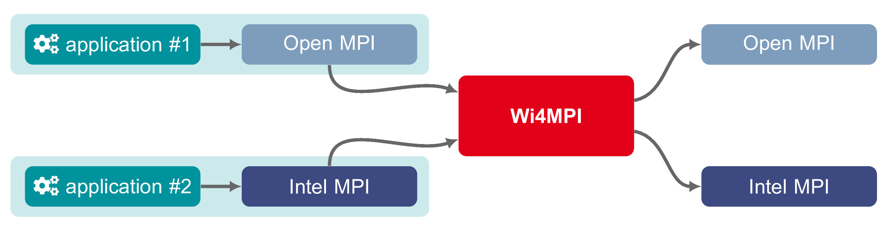
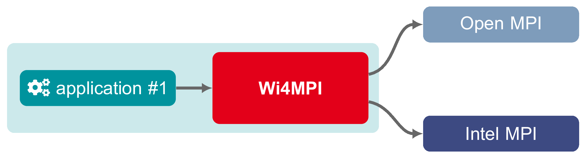

Introduction
============

MPI (Message Passing Interface) is a widely used standard in the HPC community
that enables efficient communication in distributed computing environments.
Today, multiple MPI implementations exist, including Open MPI, MPICH, IntelMPI,
or MPC, each with its own Application Binary Interface (ABI). As a result, an
application compiled with one MPI implementation is not directly compatible
with another without recompilation.

WI4MPI addresses this limitation by allowing an application compiled with an
"alpha" MPI implementation to run seamlessly under a "beta" MPI implementation—
without requiring recompilation or ABI compatibility adjustments (Preload
Version).

Preload Mode illustration:

Additionally, WI4MPI can function as a dedicated MPI implementation. In this
mode, applications are compiled against the WI4MPI library (`libmpi.so`) using
its dedicated wrappers (e.g., `mpicc`, `mpif90`). These applications can then
run on any MPI implementation, ensuring broader compatibility (Interface
Version).

Interface Mode illustration:

