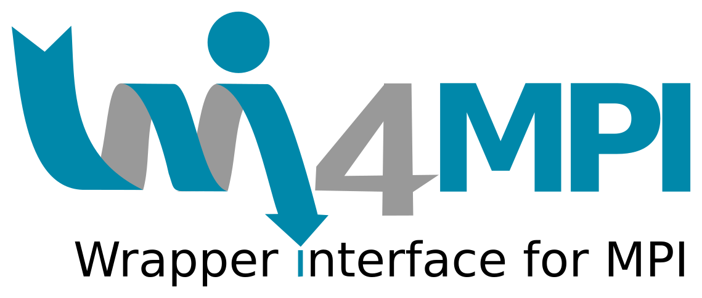

# ISC 2023: Addressing ABI Incompatibility in MPI 

## Preliminary Tutorial Notebook 

 

   

### Table of Contents 

* [Getting Wi4MPI](building-wi4mpi.md)
* [Translating MPI dynamically using Preload mode](preload.md)
* [Translating MPI dynamically using Interface mode](interface.md)
* [Applying Wi4MPI to distributed Python](mpi4py.md)
* Applying Wi4MPI to containers
   * US Exascale Computing Project: [e4s-cl](e4scl.md)
   * RedHat container runtime: [podman](podman.md)
   * CEA container runtime: [pcocc](pcocc.md)

